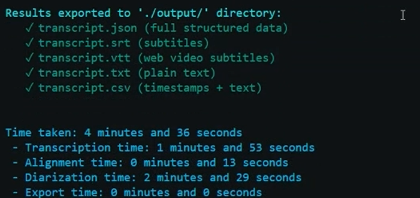
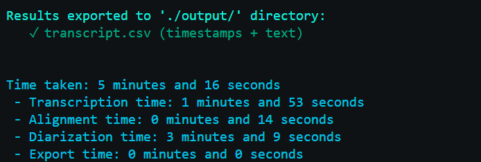

# WhisperX Environment Setup & Fine-Tuning Guide

## 1. Create and Activate Python Virtual Environment

```sh
python3.11 -m venv venv311
# On Windows:
venv311\Scripts\activate
# On Mac/Linux:
source venv311/bin/activate
```

## 2. Upgrade pip

```sh
python.exe -m pip install --upgrade pip
```

## 3. Install Dependencies

```sh
pip install -r requirements.txt
pip install whisperX
```

#### OPTIONAL ffmpeg download

You may optionally need to download ffmpeg, make sure you install **version 7.1.2** or **7.1.1**  for [mac]  (https://formulae.brew.sh/formula/ffmpeg#default) (NOTE: requires Homebrew to be installed) or [windows](https://github.com/GyanD/codexffmpeg/releases)

If you're on **Mac** you will have to export to your path once downloaded. Ask @Sabayara82 for any further clarifications.

## 4. (Optional) Install CUDA for GPU Acceleration

- Make sure you have a compatible NVIDIA GPU and CUDA drivers.
- See [PyTorch CUDA Installation Guide](https://pytorch.org/get-started/locally/).

## 5. .ENV Setup

1. Register at [Hugging Face](https://huggingface.co).
2. Get your access token with READ permissions.
3. Create `.env` file in this folder holding the hugging face token and the rest of the variables found in the `sample.env` **Importantly set the AUDIO_FILE_PATH variable to the file you wish to transcribe.**:

```
HUGGING_FACE_TOKEN=
CHUNK_LENGTH=10 # in minutes
CHUNK_OVERLAP=0.5 # in minutes
DEVICE=cpu # or cuda for NVIDIA GPU
AUDIO_FILE_PATH=
OUTPUT_DIR=./output

# using offline models for pyannote
PYANNOTE_CACHE_DIR=./pyannote_models
# 0 is false (use online model), 1 is true (use offline model)
USE_OFFLINE_MODELS = 0
```

## 5.1 Download Pyannote Locally

We want to run diarization locally to speed up our transcription times, and maintain privacy laws. **We still need the authentication token to first download the model**.

Ensure you have enough disk space (~3.5GB) and the authentication token from Hugging Face.
Instructions:
1. Accept user conditions at. University is "University of Caglgary" and the webiste can be the UofC default website "https://ucalgary.ca/":
   - https://huggingface.co/pyannote/speaker-diarization-3.1
   - https://huggingface.co/pyannote/segmentation-3.0
2. Get your token from: https://huggingface.co/settings/tokens
3. Run: python download_pyannote.py:
```sh
    cd WhisperX
    python download_pyannote.py
``` 

Once the model is downloaded successfully, set the environment variable ```USE_OFFLINE_MODELS=1```.
### Timings BEFORE locally downloaded model

### Timings AFTER locally downloaded model



## 6. Running whisper.py to Transcribe Audio on Base WhisperX Model
Run the whisper.py file found in `whisperX`:
```sh
    cd WhisperX
    python whisper.py
```
---

## 7. (optional) Download pip WhisperX package

NOTE: Make sure you're in the python venv environment before doing any pip installs.

```sh
pip install whisperx
```

and run using the test .wav file, include your HF_Token:
```sh
whisperx test_data/ShortParamedicClip.wav --compute_type int8 --hf_token YOUR_TOKEN_HERE  --model large-v2 --diarize --highlight_words True
```
## Troubleshooting

- If you have dependency issues, reinstall them or check [WhisperX Issues](https://github.com/m-bain/whisperx/issues).
- For advanced usage, see the [WhisperX documentation](https://github.com/m-bain/whisperx).

---

## References

- [WhisperX GitHub](https://github.com/m-bain/whisperx)
- [OpenAI Whisper](https://github.com/openai/whisper)
- [Hugging Face](https://huggingface.co)
- [PyTorch](https://pytorch.org)

---

**Note:** Fine-tuning requires a suitable dataset and a GPU is recommended for best performance.

# MacBook Specific

Mac users (especially on macOS Big Sur or later and on Apple Silicon / M1/M2) sometimes run into dependency conflicts with `torch`, `torchaudio`, and `protobuf`. Below are recommended steps and a suggested `requirements-mac.txt` that has worked for others..

Quick summary — what to do on macOS
- Create and activate a Python 3.11 venv (or use conda if you prefer).
- Install ffmpeg via Homebrew.
- Install the pinned Python packages below. If you have an Apple Silicon Mac and want MPS support, follow PyTorch's macOS/MPS install instructions from https://pytorch.org/get-started/locally/.

Homebrew ffmpeg (recommended):

```sh
# install Homebrew first if you don't have it: https://brew.sh/
brew install ffmpeg
```

Recommended `requirements-mac.txt` for macOS. Use the txt file for the most updated version of the requirements.

```text
torch==2.2.2
torchvision==0.17.2
torchaudio==2.2.2
transformers>=4.30.0
numpy>=1.23.0,<2.0
soundfile>=0.12.1
tqdm>=4.65.0
huggingface-hub>=0.16.0
sentencepiece>=0.1.99
openai-whisper>=20230314
python-dotenv>=1.0.0
pyannote.audio>=3.1.0
whisperx>=3.1.1
pandas>=1.5.0
protobuf<=3.20.1
pathlib; python_version < "3.4"
pyqt5<5.13; extra == "spyder"
pyqtwebengine<5.13; extra == "spyder"
```

Notes and troubleshooting
- protobuf: pinning `protobuf<=3.20.1` avoids known compatibility errors with some packages that require the older protobuf API surface.
- PyTorch / torchaudio: macOS wheels and MPS support may be different from Linux/Windows. If you want MPS acceleration on Apple Silicon, follow the official PyTorch instructions for macOS (select the appropriate options at https://pytorch.org/get-started/locally/). For many mac users, installing the above pinned `torch` / `torchaudio` versions via `pip` works; if not, prefer `conda` or the wheel links from the PyTorch site.
- If you receive errors like `AttributeError: module 'torchaudio' has no attribute 'AudioMetaData'` it usually indicates a version mismatch between `pyannote.audio` and `torchaudio`. Using the pinned `torchaudio` above (2.2.2) together with `pyannote.audio>=3.1.0` resolves that for the Mac contributor who reported the issue. If problems persist, try creating a fresh venv and installing only the pinned requirements.

Install example (venv + pip)

```cmd
python3.11 -m venv venv311
venv311/bin/activate 
python -m pip install --upgrade pip
pip install -r requirements.txt
```

If you prefer a safer approach, create a fresh virtual environment and then install only these pins. This avoids interfering with other projects or global packages.